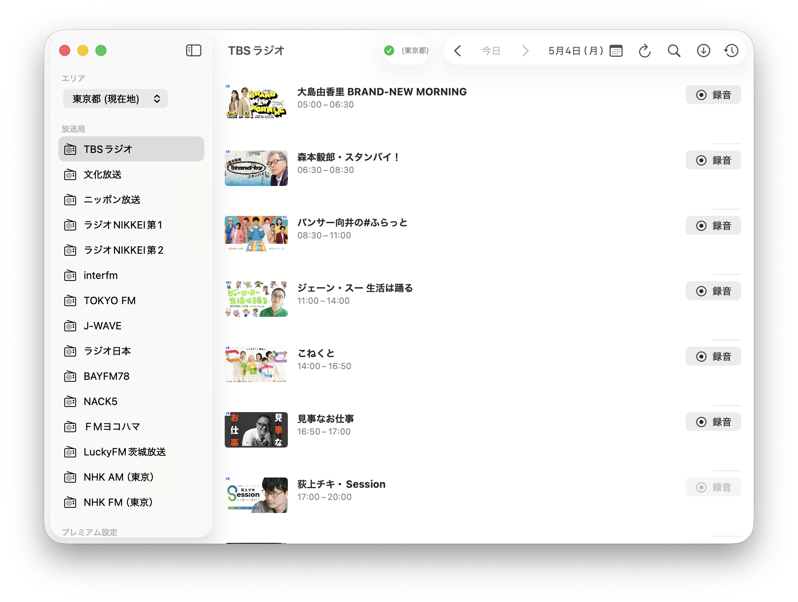

# Kiko

radiko のタイムフリー番組を高速ダウンロードする macOS アプリです。
CLI ツールが多い中、GUI で直感的に操作できるのが特徴です。

 



## 機能

- **番組表の閲覧** — 放送局・日付を指定して番組表を表示
- **高速ダウンロード** — HLS セグメントの並列取得により短時間で録音
- **一括ダウンロード** — 番組を検索して複数まとめてダウンロード
- **時間指定録音** — 番組表にない時間帯も開始・終了時刻を指定して録音
- **エリアフリー対応** — radiko プレミアム会員は全国の放送局を受信可能
- **ダウンロード履歴** — 完了した録音を一覧表示、Finder からすぐ開ける

## 必要なもの

- macOS 13 Ventura 以降（Apple Silicon）
- [Homebrew](https://brew.sh) 経由でインストールした ffmpeg

```bash
brew install ffmpeg
```

## インストール

1. このリポジトリをクローン
2. `Kiko.xcodeproj` を Xcode で開く
3. ターゲットを `My Mac` に設定してビルド（`⌘B`）
4. `Product → Show Build Folder in Finder` から `Kiko.app` を取り出す

## 使い方

### 番組をダウンロードする

1. サイドバーから放送局を選択
2. 聴きたい番組の「録音」ボタンをクリック
3. ダウンロード完了後、設定したフォルダに `.m4a` で保存される

### 番組を検索してまとめてダウンロードする

1. ツールバーの検索ボタン（🔍）をクリック
2. 番組名のキーワードを入力して検索（過去 1 週間が対象）
3. ダウンロードしたい番組にチェックを入れて「ダウンロード」

### radiko プレミアムでログインする

`設定 → アカウント` からメールアドレスとパスワードを入力するとエリアフリーが有効になります。

## 設定

| 項目 | 内容 |
|------|------|
| ダウンロード先 | 保存フォルダを変更できます（デフォルト: `~/Downloads`） |
| アカウント | radiko プレミアムのログイン情報 |

## ファイル名の形式

```
[yyyyMMdd]_放送局名_番組タイトル.m4a
```

## ライセンス

[GPLv3](LICENSE)

## 免責事項

本アプリは個人利用を目的としています。radiko の[利用規約](https://radiko.jp/rg/terms/)を遵守した上でご使用ください。録音したコンテンツの再配布・商用利用はできません。
